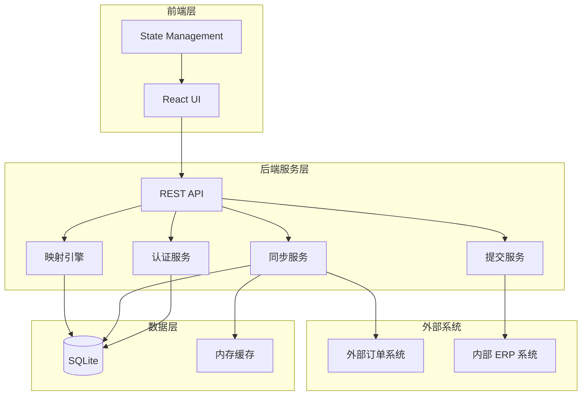

# 设计文档

## 概述

OrderLink 是一个智能订单转换工作台，旨在自动化销售人员从外部客户订单系统到内部 ERP 系统的订单转换流程。系统采用前后端分离架构，提供可视化的双面板界面，支持物料智能映射、价格审核和批量处理功能。系统使用浏览器自动化技术（Puppeteer）实现外部订单系统的数据抓取和内部 ERP 系统的订单提交。

### 核心价值

- **自动化登录**: 自动管理多个客户订单系统和内部 ERP 系统的认证凭据，消除重复登录操作
- **Web 自动化提交**: 通过浏览器自动化技术自动填写和提交内部 ERP 系统的订单表单
- **智能映射**: 基于规则引擎的物料映射系统，支持自动匹配和学习
- **可视化转换**: 左右双面板设计，清晰展示源订单和目标订单的转换过程
- **批量处理**: 支持批量同步、批量提交，提高处理效率
- **审核机制**: 对价格差异和未识别 SKU 提供人工审核流程

### 技术栈

- **前端**: React + TypeScript + Tailwind CSS
- **后端**: Node.js + Express + TypeScript
- **数据库**: SQLite（本地存储）
- **外部集成**: Puppeteer（浏览器自动化）
- **状态管理**: React Context + Hooks

## 架构

### 系统架构图



### 架构层次

#### 1. 前端层（Presentation Layer）

前端采用 React 单页应用架构，主要组件包括：

- **WorkbenchView**: 主工作台视图，包含客户选择器、状态卡片、双面板订单列表
- **MappingRulesView**: 映射规则管理界面
- **HistoryView**: 历史记录查询界面
- **AutomationSettingsView**: 自动化配置界面
- **MaterialSelectorDialog**: 物料选择对话框

状态管理采用 Context API + useReducer 模式，主要状态包括：
- 当前选中客户
- 外部订单列表
- 内部订单草稿列表
- 映射规则缓存
- UI 状态（加载中、错误提示等）

#### 2. 后端服务层（Service Layer）

后端采用模块化设计，主要服务模块：

**认证服务（AuthService）**
- 管理外部系统认证凭据的加密存储
- 提供自动登录和会话管理功能
- 支持多种认证方式（用户名密码、Token、OAuth 等）

**同步服务（SyncService）**
- 使用 Puppeteer 自动化浏览器操作
- 从外部订单系统抓取订单数据
- 解析 HTML/API 响应并标准化数据格式
- 支持增量同步和全量同步

**映射引擎（MappingEngine）**
- 基于规则匹配外部物料编码到内部物料编码
- 支持精确匹配、模糊匹配和正则表达式匹配
- 价格比对和差异检测
- 映射规则的学习和优化

**提交服务（SubmitService）**
- 通过浏览器自动化（Puppeteer）登录内部 ERP 系统
- 自动填写和提交订单表单
- 从提交成功页面提取 ERP 订单号
- 支持单个提交和批量提交（复用浏览器会话）
- 处理表单验证错误和重试逻辑
- 记录提交历史和状态跟踪

#### 3. 数据层（Data Layer）

使用 SQLite 作为本地数据库，主要数据表：
- customers: 客户配置信息
- credentials: 加密的认证凭据（外部系统和内部 ERP 系统）
- erp_form_configs: 内部 ERP 系统的 Web 表单配置
- external_orders: 外部订单数据
- internal_orders: 内部订单草稿
- mapping_rules: 物料映射规则
- conversion_history: 转换历史记录
- automation_configs: 自动化配置

内存缓存用于：
- 当前会话的订单数据
- 频繁访问的映射规则
- 客户配置信息

## 组件和接口

### 前端组件

#### WorkbenchView

主工作台组件，负责整体布局和订单转换流程。

```typescript
interface WorkbenchViewProps {
  // 无 props，使用全局状态
}

interface WorkbenchState {
  selectedCustomer: Customer | null;
  externalOrders: ExternalOrder[];
  internalOrderDrafts: InternalOrderDraft[];
  selectedOrderIds: string[];
  isSyncing: boolean;
  lastSyncTime: Date | null;
}
```

主要功能：
- 渲染客户选择器和状态卡片
- 管理左右双面板的订单列表
- 处理订单选择和批量操作
- 触发同步和提交操作

#### CustomerSelector

客户选择下拉组件。

```typescript
interface CustomerSelectorProps {
  customers: Customer[];
  selectedCustomer: Customer | null;
  onCustomerChange: (customer: Customer) => void;
}
```

#### StatusCards

状态统计卡片组件。

```typescript
interface StatusCardsProps {
  pendingCount: number;
  reviewCount: number;
  completedTodayCount: number;
}
```

#### ExternalOrderList

外部订单列表组件（左侧面板）。

```typescript
interface ExternalOrderListProps {
  orders: ExternalOrder[];
  selectedIds: string[];
  onSelectionChange: (ids: string[]) => void;
}
```

#### InternalOrderDraftList

内部订单草稿列表组件（右侧面板）。

```typescript
interface InternalOrderDraftListProps {
  drafts: InternalOrderDraft[];
  onSubmit: (draftId: string) => void;
  onReviewPrice: (draftId: string) => void;
  onSelectMaterial: (draftId: string) => void;
}
```

#### MaterialSelectorDialog

物料选择对话框组件。

```typescript
interface MaterialSelectorDialogProps {
  isOpen: boolean;
  externalMaterial: ExternalMaterial;
  onConfirm: (internalMaterial: InternalMaterial, rememberMapping: boolean) => void;
  onCancel: () => void;
}
```

### 后端 API 接口

#### 客户管理 API

```typescript
// GET /api/customers
// 获取所有客户列表
Response: { customers: Customer[] }

// POST /api/customers/:customerId/select
// 选择客户并初始化会话
Response: { success: boolean; sessionId: string; }
```

#### 订单同步 API

```typescript
// POST /api/sync/:customerId
// 同步指定客户的外部订单
Request: { fullSync?: boolean; }
Response: { success: boolean; newOrdersCount: number; lastSyncTime: string; }

// GET /api/orders/external/:customerId
// 获取外部订单列表
Response: { orders: ExternalOrder[]; }
```

#### 映射和转换 API

```typescript
// POST /api/mapping/convert
// 将外部订单转换为内部订单草稿
Request: { externalOrderIds: string[]; }
Response: { drafts: InternalOrderDraft[]; }

// GET /api/mapping/rules
// 获取所有映射规则
Response: { rules: MappingRule[]; }

// POST /api/mapping/rules
// 创建新的映射规则
Request: { externalSku: string; internalSku: string; customerId?: string; }
Response: { rule: MappingRule; }
```

#### 订单提交 API

```typescript
// POST /api/submit/single
// 通过 Web 自动化提交单个订单到 ERP
Request: { draftId: string; }
Response: { success: boolean; erpOrderId?: string; error?: string; }

// POST /api/submit/batch
// 批量提交订单到 ERP（复用浏览器会话）
Request: { draftIds: string[]; }
Response: { results: {...}[]; successCount: number; failureCount: number; }
```

## 数据模型

### 核心实体

#### Customer（客户）

```typescript
interface Customer {
  id: string;
  name: string;
  displayName: string;
  icon?: string;
  externalSystemUrl: string;
  externalSystemType: 'web' | 'api';
  erpSystemId: string;
  isActive: boolean;
  createdAt: Date;
  updatedAt: Date;
}
```

#### ExternalOrder（外部订单）

```typescript
interface ExternalOrder {
  id: string;
  customerId: string;
  externalOrderId: string;
  externalSku: string;
  quantity: number;
  unitPrice: number;
  currency: string;
  orderDate: Date;
  status: 'pending' | 'converted' | 'submitted' | 'failed';
  rawData: Record<string, any>;
  syncedAt: Date;
  createdAt: Date;
}
```

#### InternalOrderDraft（内部订单草稿）

```typescript
interface InternalOrderDraft {
  id: string;
  externalOrderId: string;
  customerId: string;
  internalSku?: string;
  quantity: number;
  unitPrice?: number;
  mappingStatus: 'perfect_match' | 'price_discrepancy' | 'sku_unrecognized';
  priceDiscrepancy?: {
    externalPrice: number;
    internalPrice: number;
    difference: number;
    differencePercent: number;
  };
  status: 'draft' | 'submitted' | 'failed';
  createdAt: Date;
  updatedAt: Date;
}
```

#### MappingRule（映射规则）

```typescript
interface MappingRule {
  id: string;
  externalSku: string;
  internalSku: string;
  customerId?: string;
  matchType: 'exact' | 'fuzzy' | 'regex';
  priority: number;
  isActive: boolean;
  usageCount: number;
  createdBy: 'system' | 'user';
  createdAt: Date;
  updatedAt: Date;
}
```

## 正确性属性

系统定义了 52 个正确性属性，涵盖：

| 类别 | 属性数 | 说明 |
|------|--------|------|
| **UI 渲染** | 12 个 | 客户列表、订单列表、状态卡片等 |
| **订单分类** | 3 个 | Perfect Match/Price Discrepancy/SKU Unrecognized |
| **数据持久化** | 8 个 | 映射规则、认证凭据、自动化配置等 |
| **Web 自动化** | 6 个 | ERP 登录、表单填写、提交等 |
| **错误处理** | 5 个 | 异常日志、错误通知、重试等 |
| **批量操作** | 3 个 | 批量提交、结果统计等 |
| **筛选查询** | 5 个 | 历史记录、映射规则筛选等 |

## 错误处理

### 错误分类

| 类别 | 场景 | 处理策略 |
|------|------|----------|
| **网络连接** | 外部系统/ERP 连接失败 | 重试 3 次，指数退避 |
| **认证授权** | 凭据无效/权限不足 | 记录日志，提示用户更新 |
| **数据验证** | 映射失败/ERP 验证错误 | 标记状态，允许编辑重试 |
| **数据解析** | HTML/JSON 解析失败 | 保存原始数据，提示技术支持 |
| **数据库** | 连接失败/写入失败 | 事务处理，确保一致性 |
| **业务逻辑** | 批量操作部分失败 | 继续处理，显示汇总结果 |

## 测试策略

### 测试方法

**单元测试** - 验证具体场景和边界情况
**基于属性的测试 (PBT)** - 验证 52 个正确性属性

### 测试覆盖目标

| 模块 | 覆盖率目标 |
|------|------------|
| 整体代码 | >80% |
| 关键业务逻辑 | >90% |
| API 端点 | 100% |
| 错误处理路径 | >70% |

### 测试执行

```bash
# 运行所有测试
npm test

# 运行特定测试文件
npm test -- MappingEngine.test.ts

# 生成覆盖率报告
npm test -- --coverage
```
